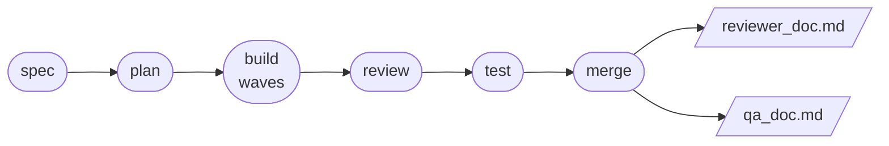
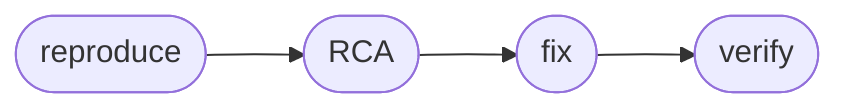

<div align="center"><pre>
██╗     ██╗███████╗███████╗██╗     ██╗███╗   ██╗███████╗
██║     ██║██╔════╝██╔════╝██║     ██║████╗  ██║██╔════╝
██║     ██║█████╗  █████╗  ██║     ██║██╔██╗ ██║█████╗  
██║     ██║██╔══╝  ██╔══╝  ██║     ██║██║╚██╗██║██╔══╝  
███████╗██║██║     ███████╗███████╗██║██║ ╚████║███████╗
╚══════╝╚═╝╚═╝     ╚══════╝╚══════╝╚═╝╚═╝  ╚═══╝╚══════╝
        Your coding agent — now it leaves a paper trail. 🪢
</pre></div>

<div align="center">

[](LICENSE)


</div>

lifeline runs the full dev lifecycle — spec → plan → build → review → test → merge — as
gated phases that produce real artifacts a human can read: a spec, a plan, reviews, an
audit log, and reviewer/QA handoff docs. It's coverage-honest (passing tests ≠ proof) and
runs the same on Claude Code and Cursor. 🪢

## 🚀 Quickstart

**Claude Code**

```
/plugin marketplace add RAHUL445/lifeline
/plugin install lifeline@lifeline
```

**Cursor** (≥ 2.5): Settings › Plugins › Add Marketplace › Import from Repo →
`RAHUL445/lifeline`, then install **lifeline**.

Installed? Just talk — *"let's build a rate limiter"* — or run `/lifeline:lifecycle start`.
The **[Getting Started](docs/GETTING-STARTED.md)** guide walks your first cycle end to end
(install details, the setup wizard, every command). 🧭

## 🧠 How it works



A feature moves through six gated phases. At each one, lifeline dispatches a **focused
role** — spec-writer, architect, implementer, reviewer, test-runner — that role returns a
structured payload, and the orchestrator writes a **durable artifact** to disk before
advancing. You approve (or override) at every gate. Nothing happens off the record: every
gate, retry, verdict, and override lands in an append-only `flow.md`.

| Phase | What happens | Leaves behind |
|---|---|---|
| 📝 **Spec** | Intent → testable spec. Open questions surfaced, never assumed. | `spec.md` |
| 🗺️ **Plan** | 2–3 approaches proposed, one chosen, work split into dependency-ordered waves. | `plan.md` |
| 🔨 **Build** | TDD per task (RED→GREEN→REFACTOR). Independent tasks run in parallel on full tier. | `task.md` |
| 🔎 **Review** | One review per task, four lenses — logic, architecture, security, performance — depth scaled to effort. | `review.md` |
| 🧪 **Test** | Tests run; coverage measured on *changed* files; every gap → a smoke-checklist line. | `test_result.md` |
| 🚀 **Merge** | Invariant check, override audit, smoke gate → two handoff docs, then branch action. | `reviewer_doc.md`, `qa_doc.md` |

**Two ways in, same engine:**

- **💬 Ambient** — skills auto-trigger on intent. *"review this"* fires a four-lens review,
  *"are we sure this works?"* fires coverage→smoke. Each skill stands alone — no command
  required.
- **🎬 Orchestrated** — one command runs the whole gated cycle with persisted state and a
  short setup wizard. Close your laptop mid-cycle; it cold-resumes from disk on any harness.

Both paths execute the *same* skills — no duplicated logic, no drift. 🧬

### 🐛 Bonus: the debug lane

Got a bug instead of a feature? Skip spec/plan and run the focused lane:



```
/lifeline:lifecycle debug "save button drops the form on slow networks"
```

Same gates, same audit trail — and you confirm the reproduction before any fix is
attempted. No fixing ghosts. 👻

## ✨ What makes it different

1. **📊 Coverage→smoke seeding.** Passing tests aren't proof — 152 can pass while the real
   handler is mocked and never runs. lifeline measures coverage on the *changed* files and
   turns every gap into a line in a human smoke checklist at merge. Advisory, never silent.
2. **🤝 Reviewer + QA handoff docs.** Merge emits `reviewer_doc.md` (code-visible: changes
   mapped to requirements, risks, override audit) and `qa_doc.md` (blackbox: feature flow,
   numbered test cases, smoke checklist). The humans actually know what changed.
3. **🔍 An auditable trail.** Every gate, retry, verdict, and override lands in an
   append-only flow log. Overrides are legal — but they resurface at the merge gate.
   No skeletons stay in the closet. 💀

## 🧩 What's inside

Everything under `core/` is portable markdown — pure methodology, zero runtime calls.
Each adapter binds it to a specific harness. Add a new harness by writing one file; you
never touch `core/`.

```
lifeline/
├── core/                      # portable methodology — markdown only, runs anywhere
│   ├── skills/                #   13 skills (spec, plan, TDD, review, coverage, debug, …)
│   ├── commands/lifecycle.md  #   the one orchestrated command
│   ├── contracts/             #   payload schemas roles must return
│   ├── templates/             #   artifact scaffolds (spec, plan, qa_doc, …)
│   ├── config/defaults.yaml   #   every knob (see docs/CONFIGURATION.md)
│   └── METHODOLOGY.md         #   master index of the above
└── adapters/                  # per-harness bindings — the only harness-specific code
    ├── claude-code/           #   FULL tier (plugin)
    ├── cursor/                #   FULL tier (≥ 2.4)
    └── codex/                 #   one-file degraded stub (the portability proof)
```

| Component | Count | Speaks |
|---|---|---|
| 🎯 Skills | 13 | the methodology — each complete on its own, auto-triggering on intent |
| 🔄 Phases | 6 (+ debug lane) | spec → plan → build → review → test → merge |
| 🔌 Primitives | 7 | the abstract runtime calls (`@dispatch_agent`, `@ask_user`, …) every adapter binds |

## 🧭 Philosophy

1. **Roles return payloads; the orchestrator writes artifacts.** Every dispatch ends in a
   structured payload, persisted to disk *before* the cycle advances. Nothing is implied.
2. **Degrade, never block.** Every capability has a documented fallback. A degraded tier
   keeps 100% of the methodology and artifacts — it only loses hard-gate *enforcement*
   (→ self-checks) and parallelism (→ sequential). That's the whole tradeoff.
3. **Coverage-honest.** Passing tests are necessary, not sufficient — line coverage can't
   see over-mocking. Gaps surface (advisory, never blocking) and route to a human smoke
   gate. 🕵️
4. **Auditable.** `flow.md` records every gate, retry, verdict, and override. Overrides
   are legal — but they're never silent, and they resurface at merge. 💀
5. **Human handoff is part of the lifecycle.** A cycle isn't done at green tests. It's done
   when a reviewer and a QA engineer can each pick up a purpose-built document. 🤝

## 📚 Docs

[Getting Started](docs/GETTING-STARTED.md) · [Configuration](docs/CONFIGURATION.md) ·
[FAQ](docs/FAQ.md) · [Architecture](docs/ARCHITECTURE.md) ·
[Portability](docs/PORTABILITY.md) · [Adding a harness](docs/ADDING-A-HARNESS.md) ·
[Methodology index](core/METHODOLOGY.md)

## 📄 License

MIT — go build something. 🛠️
