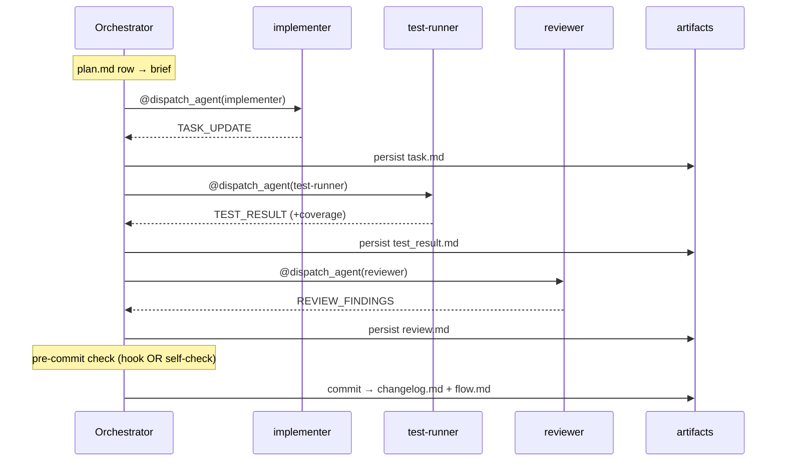

# 🏗️ Architecture

## 🧱 Core principle

The portable core is 100% markdown and references runtime capabilities only by abstract
name. Each harness ships a thin adapter binding those names to real features — or to a
documented graceful degradation. **Degrade, never block.** 🛟

```
┌────────────────────────────── core/ (byte-identical everywhere) ───────────────┐
│  METHODOLOGY.md          master index                                          │
│  capability-manifest.yaml  the 7 @primitive contracts + degradations           │
│  skills/<15>/SKILL.md    ALL methodology (auto-trigger + invoked by command)   │
│  commands/lifecycle.md   the ONE orchestration command — speaks only @primitives│
│  contracts/<8>.md        payload schemas (roles return, orchestrator persists) │
│  templates/<11>.tmpl     artifact skeletons                                    │
│  config/defaults.yaml    portable knobs                                        │
└────────────────────────────────────────────────────────────────────────────────┘
        ▲ binds                       ▲ binds                      ▲ binds
┌───────────────────┐    ┌───────────────────┐    ┌───────────────────┐
│ adapters/claude-  │    │ adapters/cursor/  │    │ adapters/codex/   │
│ code/  (FULL)     │    │ (FULL, ≥2.4)      │    │ (stub, DEGRADED)  │
│  adapter.yaml     │    │  adapter.yaml     │    │  adapter.yaml     │
│  hooks/ (4 + json)│    │  agents/ hooks/   │    │  (nothing else —  │
│  agents/ (7 thin  │    │  commands/ rules/ │    │   one file)       │
│   shells)         │    │  (.cursor-plugin) │    │                   │
└───────────────────┘    └───────────────────┘    └───────────────────┘
```

## 🪢 The seven primitives

`@dispatch_agent` · `@ask_user` · `@persist_state` · `@run_hook` · `@tool_set` ·
`@command_namespace` · `@artifact_root` — contracts and degradations in
`core/capability-manifest.yaml`.

Decision rule: *knowledge/discipline* → skill (portable). *Runtime capability the
harness must execute* (spawn isolation, block a tool call, render a choice widget,
durable state) → primitive, bound per adapter, with a degradation path. Hooks are never
required for correctness — every hard gate has a self-check twin inside the relevant
skill.

## 🐚 Why agents are thin shells

Methodology is authored exactly once, in skills. A Claude Code subagent shell is ~15
lines: "read core skill X and contract Y, follow them, return the payload." Cursor
subagent shells are the same ~15 lines against the same skills; on fallback tiers the
orchestrator reads the same skill inline. If a shell ever contains methodology, the
tiers have forked — that's the R1 drift risk, and the mitigation is this rule. One source
of truth, no clones. 🧬

## 🌊 Data flow (one wave)



At merge: invariant check → override audit → coverage GAPs seed the smoke checklist →
`@ask_user` smoke gate → handoff-docs compiles reviewer_doc.md + qa_doc.md → branch
action.

## 💾 State & resume

`@persist_state` = `.lifeline/<scope>/state.json`: `{scope, phase, mode, cycle_id,
chosen_approach, active_task, wave_attempts, wave_overrides, smoke, isolation,
dispatch_mode}`. Artifacts are the
ground truth; state is the cursor. `resuming-a-cycle` cross-checks both and trusts
artifacts on disagreement (artifacts never lie; state just forgets). FULL tier adds a
SessionStart hook that surfaces pending cycles; degraded tiers resume on the user's
"continue".

## 🗂️ Repo layout

```
lifeline/
├── .claude-plugin/{plugin.json, marketplace.json}   # Claude Code reads these
├── .cursor-plugin/{plugin.json, marketplace.json}   # Cursor reads these
├── core/            # portable — ships byte-identical to every harness
├── adapters/        # claude-code (FULL) · cursor (FULL, ≥2.4) · codex (stub)
├── docs/            # GETTING-STARTED · CONFIGURATION · FAQ · ARCHITECTURE · PORTABILITY · ADDING-A-HARNESS
└── README.md, LICENSE
```
