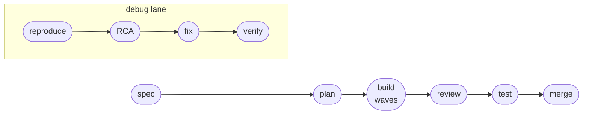

# 🚀 Getting started

A hands-on walkthrough: install lifeline, run your first cycle, and read what it leaves
behind. Works the same on Claude Code and Cursor — the only differences are the install
step and the slash-command prefix, both called out below.

If you just want the concept, read the [README](../README.md) first. This doc assumes you
want to *run* it. 🏃

---

## 1. ⏱️ What lifeline does (in one minute)

lifeline drives a feature from intent to merge through six gated phases, plus a separate
debug lane:



At each phase it dispatches a focused role (spec-writer, architect, implementer,
reviewer, …), that role returns a structured payload, and the orchestrator writes a
durable artifact before advancing. Nothing is hidden: every gate, retry, verdict, and
override lands in an append-only `flow.md`. At merge you get two handoff documents — one
for a code reviewer, one for a QA engineer — plus a smoke checklist seeded from the
coverage gaps on your *changed* files.

You can use it two ways:

- **Ambient** 💬 — the skills auto-trigger on what you say. "let's build a rate limiter"
  fires spec discipline; "review this" fires the four-lens review; "there's a bug where…"
  fires systematic debugging. Each skill works standalone, no command needed.
- **Orchestrated** 🎬 — one command runs the whole gated cycle with persisted state. This is
  what the rest of this doc walks through.

---

## 2. 📦 Install

### Claude Code

```
/plugin marketplace add RAHUL445/lifeline
/plugin install lifeline@lifeline
```

That's it — the command, all skills, the 7 role subagents, and the hooks register
automatically. Confirm with `/lifeline:lifecycle guide` (prints the discovery map,
starts nothing). 🗺️

### Cursor (≥ 2.5, plugin marketplace)

lifeline ships as a Cursor plugin. Add this repo as a marketplace, then install it:

1. Open **Dashboard › Settings › Plugins**, click **Add Marketplace › Import from Repo**,
   and point it at `RAHUL445/lifeline`.
2. (Optional) Turn on **Enable Auto Refresh** and install the **Cursor GitHub App** on the
   repo so Cursor re-indexes the plugin whenever you push (at most once every ~10 min).
3. Install the **lifeline** plugin from the imported marketplace.

Cursor reads everything straight from the plugin — the 15 methodology skills + the
lifecycle orchestrator, the 7 role subagents, the `/lifeline-lifecycle` slash command, the
hooks (pre-commit deny gate, session-start resume surfacing, diff-size log), and the
adapter rule — all resolved under `${CURSOR_PLUGIN_ROOT}`. No script to run. 🎉 Open a repo
in Cursor and confirm with `/lifeline-lifecycle guide`.

> **Tiers in one line.** Claude Code and Cursor ≥ 2.4 run at **FULL** tier — hard hook
> gates, native question widgets, parallel role dispatch. Headless runs (`--print`),
> Cursor without the plugin system, and the codex stub run **DEGRADED** — same methodology,
> same artifacts, but soft self-check gates and sequential waves. See
> [PORTABILITY](PORTABILITY.md).

---

## 3. 🎯 Your first cycle

From inside your project, start the orchestrator:

```
/lifeline:lifecycle start      # Claude Code
/lifeline-lifecycle start      # Cursor
```

(No slash commands in your session? Say "run the lifeline lifecycle start" — the
orchestrator is also registered as a skill by name.)

**Optional but recommended on a fresh repo:** run `lifecycle setup` first. It runs the
same wizard below but stops without starting a cycle — a deliberate one-time configure that
auto-detects your project's lint/test tooling and writes `.lifelinerc`. Skip it and `start`
just configures inline the first time; either way you only answer once.

### 3a. 🧙 The setup wizard (first run only)

`start` (or `setup`) opens a short wizard. Each question has a recommended default; you can
take them all and move on (lazy is fine). It asks:

1. **Storage location** — keep artifacts in-repo at `.lifeline/` (recommended) or at an
   absolute path elsewhere.
2. **Version control** — commit the artifacts or gitignore them (in-repo only).
3. **Scope** — a short name for this unit of work (e.g. `rate-limiter`). All artifacts
   land in `.lifeline/<scope>/`.
4. **Isolation** — a git worktree (FULL tier only), a new `lifeline/<scope>` branch, or
   the current branch.
5. **Autonomy** — *gated* (you approve each phase) or *auto* (runs through, stopping only
   on a hard gate or a blocking question).
6. **Advanced (optional)** — retry cap, coverage threshold, and `dispatch_mode`
   (`auto`/`agent`/`inline` — how roles execute; see the FAQ).
7. **Project tooling** — lifeline inspects your repo's OWN config (package.json scripts,
   Makefile, pyproject, Cargo.toml, monorepo workspaces, …) and proposes the `lint`/`test`
   commands it found. Confirm, edit, or skip. Nothing detected runs until you confirm here
   — it's the trust gate for the pre-commit lint hook. (Monorepos get a per-package command
   each.)

Your answers persist to a repo-root `.lifelinerc`. Once it's complete the wizard is skipped
entirely on later cycles — only scope is asked. Re-run it any time with `lifecycle setup`
(or `lifecycle start --reconfigure`). 💾

### 3b. 👀 What you'll see, phase by phase

With a typical feature and *gated* autonomy:

| Phase | What happens | Artifact written |
|---|---|---|
| **Spec** | Your intent becomes a testable spec; open questions are surfaced, never assumed. You approve. | `spec.md` |
| **Plan** | 2–3 approaches proposed, one chosen, work split into dependency-ordered waves with effort labels. | `plan.md` |
| **Build** | Each wave's tasks run TDD (RED→GREEN→REFACTOR). On FULL tier, independent tasks in a wave dispatch in parallel. | `task.md` |
| **Review** | Exactly one review per task, all four lenses (logic, architecture, security, performance), depth scaled to effort. | `review.md` |
| **Test** | Tests run; coverage is measured on the *changed files*; gaps become smoke-checklist lines. | `test_result.md` |
| **Merge** | Pre-merge invariant check, override audit, smoke gate, branch action — then the two handoff docs. | `reviewer_doc.md`, `qa_doc.md` |

Every step also appends to `flow.md` (the audit trail) and `state.json` (resume point).

### 3c. 🚦 Gates and overrides

At a gate you approve, reject, or **override**. Overrides are legal — but they're never
silent: each one is logged to `flow.md` and resurfaces at the merge gate and in the
reviewer doc. No sneaking it past the bouncer. 🕵️ On FULL tier a bad commit (e.g. a planted
secret on a `lifeline/*` branch) is physically blocked by the pre-commit hook; on degraded
tiers the same check runs as a mandatory self-check and is logged as advisory.

---

## 4. 🐛 The debug lane

For bugs, skip spec/plan and run the focused lane:

```
/lifeline:lifecycle debug "save button silently drops the form on slow networks"
```

It runs reproduce → root-cause analysis (gated) → fix → verify, writing `bug.md` and the
same flow/state trail. You confirm the reproduction before any fix is attempted — no
fixing ghosts. 👻

---

## 5. ⏸️ Stopping and resuming

A cycle survives a closed session. To pick up where you left off:

```
/lifeline:lifecycle continue
```

State is read from `.lifeline/<scope>/state.json`. On FULL tier the session-start hook
even surfaces "cycle pending — run continue" automatically, so cold resume needs no memory
of where things stood (your future self says thanks). Other handy commands:

```
/lifeline:lifecycle status     # where am I, what's next
/lifeline:lifecycle abort      # stop the cycle cleanly
/lifeline:lifecycle setup      # configure this project once (detect lint/test tools), no cycle
/lifeline:lifecycle doctor     # read-only health check: primitives bound? files wired? commands runnable?
/lifeline:lifecycle guide      # print the discovery map, start nothing
```

---

## 6. 🎁 What you end up with

After a merge, `.lifeline/<scope>/` holds the full trail:

```
spec.md (or bug.md)   plan.md        task.md         review.md
test_result.md        flow.md        changelog.md    state.json
reviewer_doc.md       qa_doc.md
```

- **`reviewer_doc.md`** — code-visible: per-file changes mapped to requirements, design
  decisions, risk areas, findings, and the override audit. Hand to a code reviewer.
- **`qa_doc.md`** — blackbox: feature flow, numbered test cases, the smoke checklist,
  known limitations. Hand to a QA engineer.
- **`test_result.md`** — per-file coverage blocks, with each gap spelled out
  (`⚠ file — 12% coverage, lines 41–58 untested. Manually exercise this path.`).

---

## 🧭 Next steps

- Questions or stuck? → [FAQ](FAQ.md)
- How portability actually works → [PORTABILITY](PORTABILITY.md)
- The architecture (core + adapters) → [ARCHITECTURE](ARCHITECTURE.md)
- Add lifeline to a new harness → [ADDING-A-HARNESS](ADDING-A-HARNESS.md)
